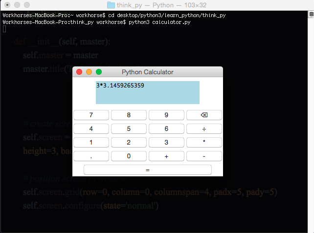
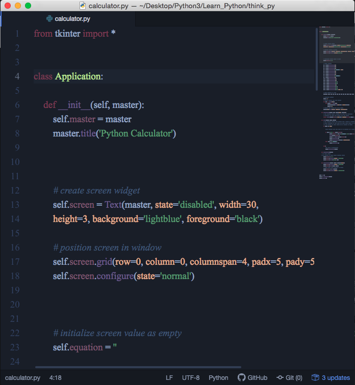

# Python Tkinter Application

#This application was created with the help of Adeyinka Adegbenro's Culculator Tutorial.
It helped my grasp the concepts of classes, user defined definitions, and tkinder module.

< img src='images/python_gui.png' width=100>

 
